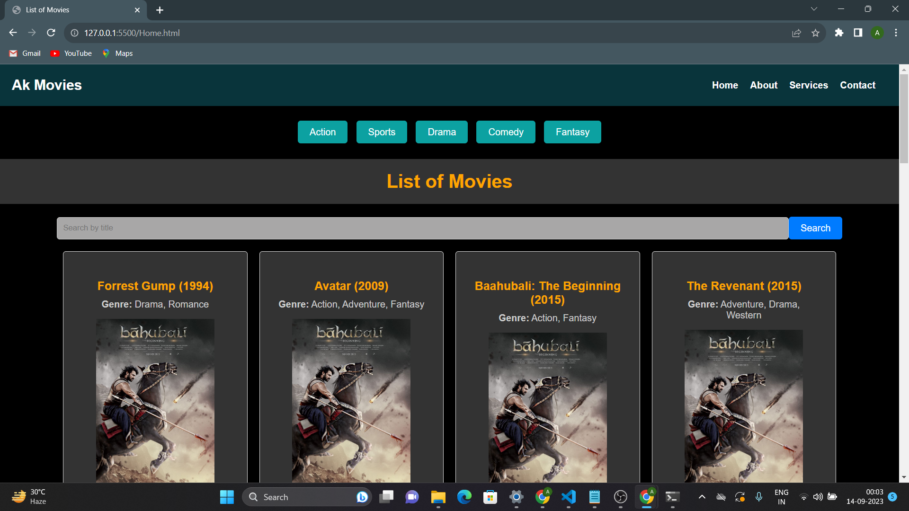
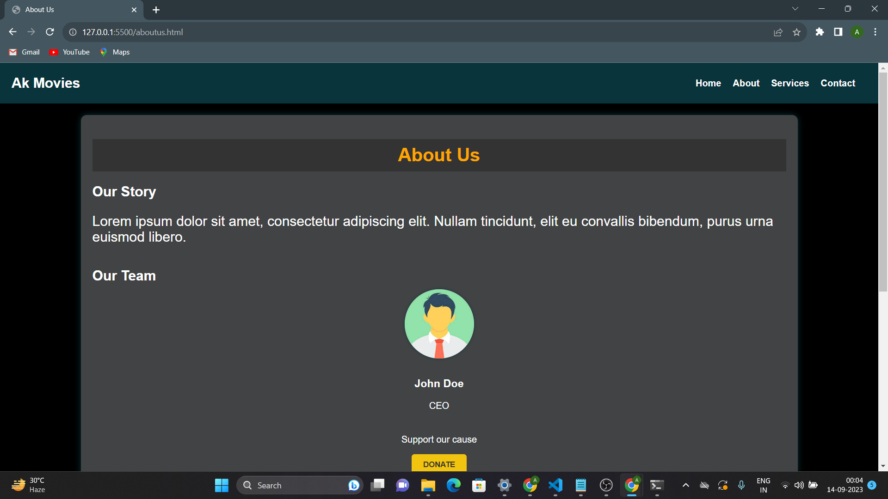
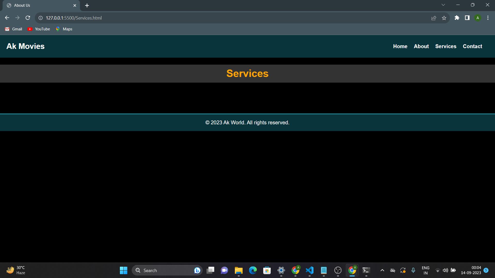
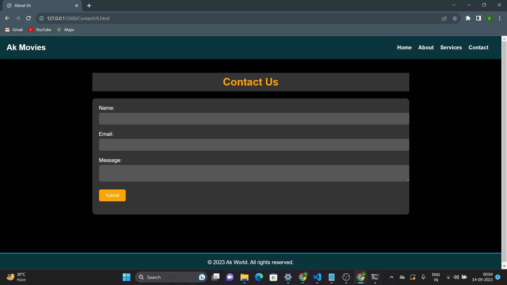
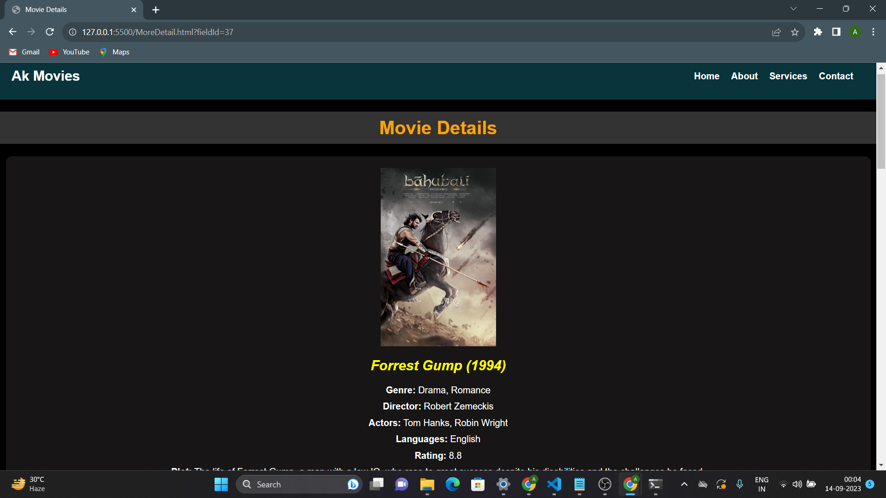
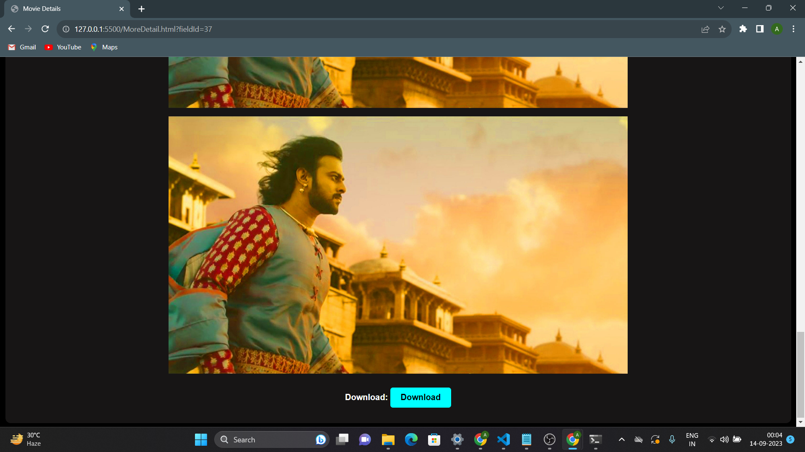
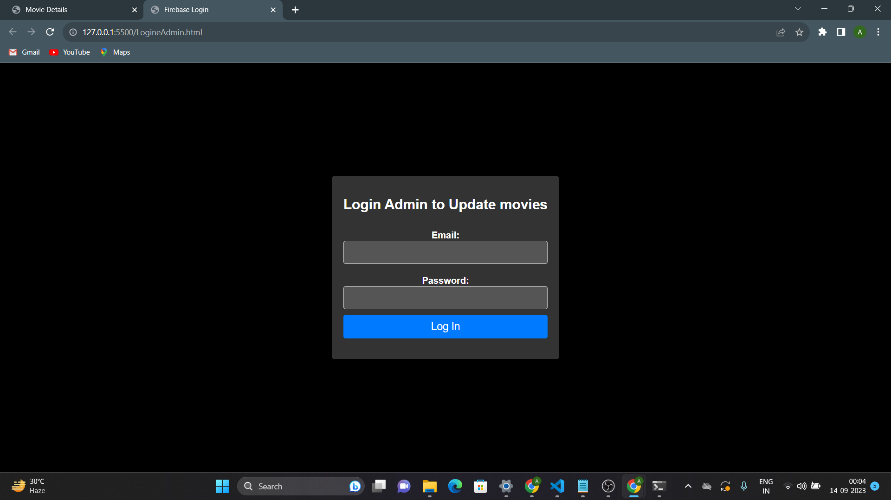
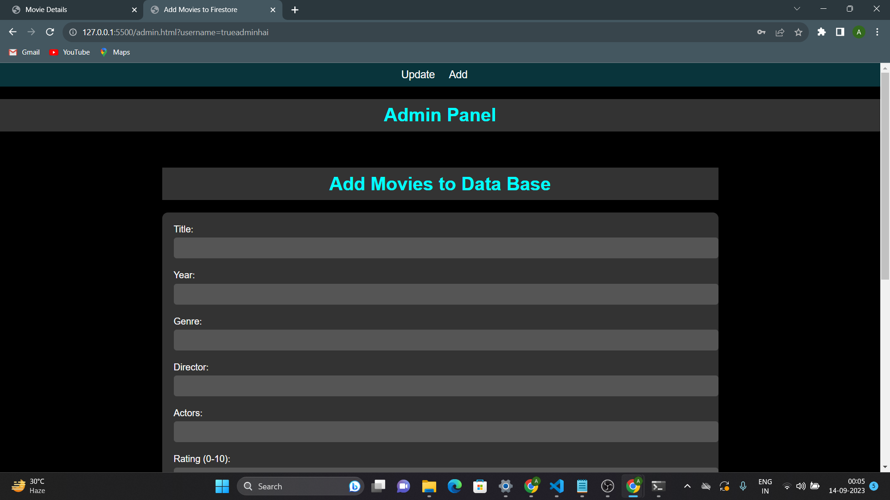
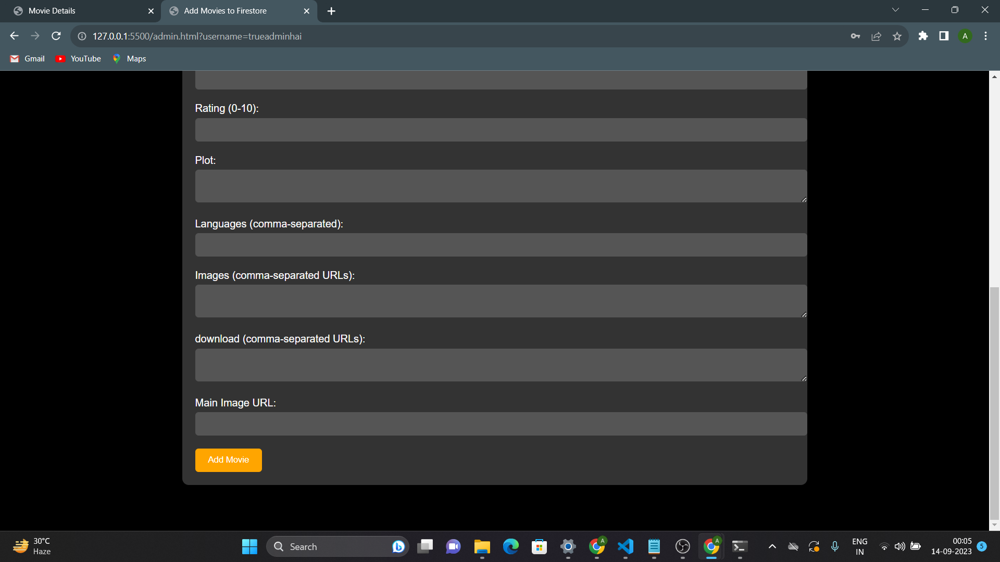

# Movie Download Website README

Welcome to the Movie Download Website project repository! This repository contains the code and resources for our movie download website powered by Firebase. This README will provide you with an overview of the project, how to set it up, and important information for contributors and users.

## Table of Contents

1. [Project Overview](#project-overview)


## Project Overview

### Description

The Movie Download Website is a platform for users to access and download movies. It provides a user-friendly interface to browse, search, and download movies in various genres. Users can also find information about movies, including descriptions, ratings, and release dates.

### Features

- **Browse and Search**: Users can browse movies by genre or use the search feature to find specific movies.

- **Movie Details**: Each movie page displays detailed information about the movie, including its plot, cast, release date, and ratings.

- **Download Movies**: Users can download movies in various formats and quality options.


### Technologies Used

- Firebase: Firebase is used for authentication, storage, and hosting.
- HTML, CSS, JavaScript: Front-end development.

<div align="center">
  
</div>

<p align="left">Your description goes here. Lorem ipsum dolor sit amet, consectetur adipiscing elit. Sed at tellus ac odio tincidunt interdum.</p>


### Screenshots
 ##Users
<div style="display: flex; justify-content: space-between;">
  
  
    
      
        
          
            
              
                
</div>

##admin
<div style="display: flex; justify-content: space-between;">
  
  
    
</div>
## Getting Started


### Installation

1. Clone this repository to your local machine :
2. generate this By register your Website on Firebase:
    ```bash
   const firebaseConfig = {
   apiKey: "YOUR_API_KEY",
   authDomain: "YOUR_AUTH_DOMAIN",
   projectId: "YOUR_PROJECT_ID",
   storageBucket: "YOUR_STORAGE_BUCKET",
   messagingSenderId: "YOUR_MESSAGING_SENDER_ID",
   appId: "YOUR_APP_ID",
   measurementId: "YOUR_MEASUREMENT_ID"
    };

    // Initialize Firebase
    firebase.initializeApp(firebaseConfig);

3. paste it on your firebase-config.js file

Happy Coding......
